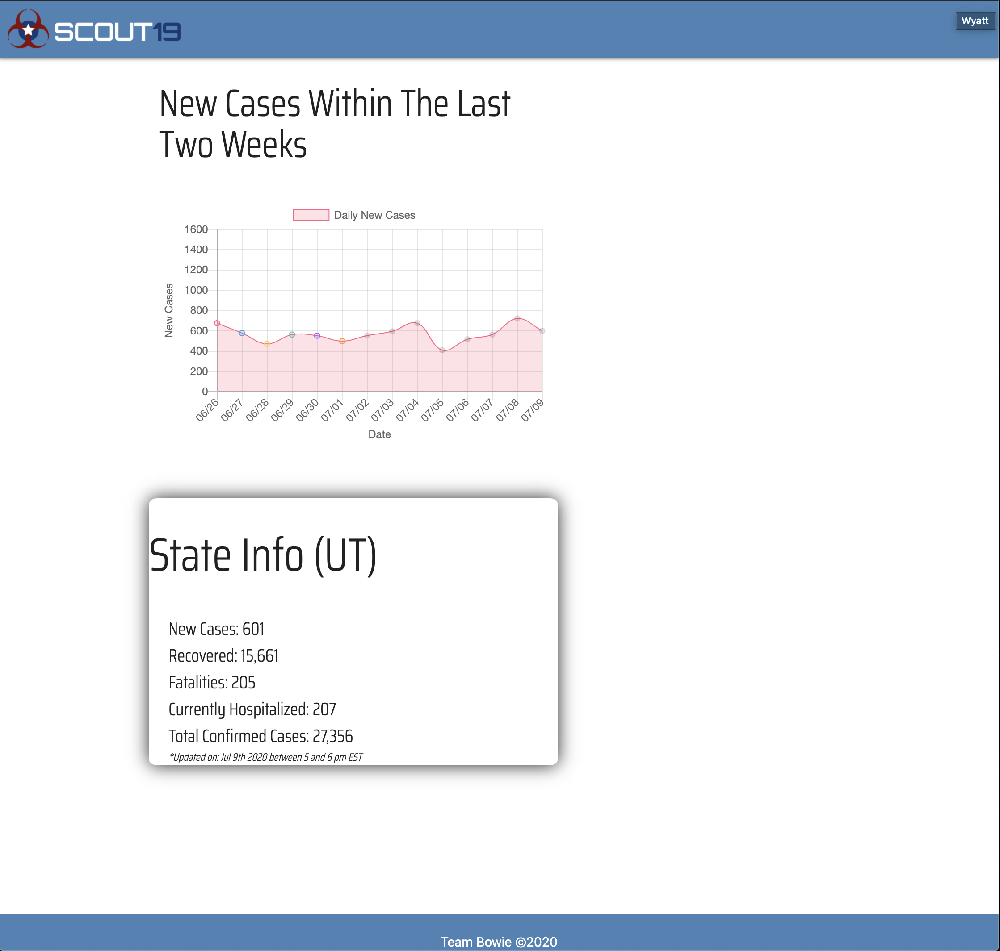

# Scout 19

## Description
- Tracks covid outbreaks across the United States
- Has a U.S map that is updated with the spread of Covid, highlighting most afflicted states
- Shows live national data
- Allows the user to search for data about a specific state (either by using their IP or manually entering the state name or initials)
- Produces a chart for that state showing positive tests rate in the past two weeks

## Elevator Pitch 
In these unique times, it can feel overwhelming and inconvenient trying to decide where to get your information about what is going on with Covid. This is a problem Team Bowie constantly dealt with as we, like many of you, seek to stay up to date on the latest developments. To combat this issue, we have built a mobile-first application that will keep national and state data about this pandemic in a single, easy to navigate location. 

## User Story
As an end user
I want to see Covid - 19 outbreaks and confirmed outbreaks by location
So that I get up to date statistics on the nation and by state

## Acceptance criteria:
- GIVEN a choice of current location or an input box
- WHEN the user chooses a location
- THEN the user is provided with the most up to date covid-19 info
- GIVEN the map of the united states
- THEN the map is color coded to display the severity of infections per state

## API's and Libraries used
- https://covidtracking.com  national and state covid-19 data updates
- https://simplemaps.com  third party api that generated the state grade map
- https://api.ipgeolocation.io/ipgeo?apiKey=8cbff660df8f427d8169bea14803ed60  detects ip address as current location
- https://www.chartjs.org  state new cases chart
- https://momentjs.com date formatting

## CSS Framework
Materialize CSS

## Team:
FRONT END: Cameron Walker, Wyatt Hancock  
BACK END: Sam Greilick, Dilan Li, David Grant

## Issues Encountered and Resolved:
- The us map we were using had a new script that we were unfamiliar with and so we had to resolve on a new api that allowed us to enter variables into the code.
- The geolocator was not responding with googles geolocator and another geolocation from api.com. So we found the current one that had a very smooth response to comb through.
- Some struggles on getting used to using branches instead of committing to the master. That is why api.js still has commits that are not pushed to the master. We had to leave some commits unpushed because they caused to many issues.
- As we made it a mobile first application we decided that it would be best to drop the background on the map as the size of the screen got larger so as to look better for every setting size.
- To take into consideration that a user might spell a state wrong, we established a filter on wrongly spelled states & state initials to prevent a blank response.
- Collaboration went well but we still have some more to learn about working in pairs as we were more accustomed to splitting up responsibilities and each working on our own thing which still worked out well in the end.

## What We Learned:
- How to adapt and work with a new css framework 
- How to make api's and third-party api's responsive to a mobile first ui
- Working in teams
- Realizing there could be different creative approaches to solve one problem

## Future Development: 
- Use Query strings so that we could build multiple htmls that would save the user’s searched state so they could share the latest data on social media.  

## Deployed website
https://corvus-cyber.github.io/SCOUT19/

## ScreenShot of Finished website

## Special thanks and Accreditations

Awesome rapheal/jquery/svg map that made my life so easy.
https://newsignature.github.io/us-map/

Thanks for da states
https://gist.github.com/bubblerun/a624de5b4fa8ff0980010054a7220977

The State-Name-to-Abbreviation function (function convert_state(name, to) {}) was retrieved from the following website:  
https://joshlevinson.me/2013/03/29/javascript-to-convert-between-states-and-abbreviations/